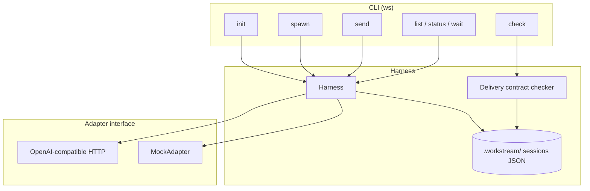

# workstream

**Multi-session agent orchestration harness** — parallel workstreams, role routing, and delivery contracts.

[](https://github.com/an1ket-s1ngh/workstream/actions/workflows/ci.yml)
[](package.json)
[](LICENSE)

> Ship software with **many focused AI workers** instead of one overloaded chat thread.

```bash
npm install -g workstream   # or: npx / local clone
ws init my-project
ws spawn --name auth --role good --prompt "Design JWT refresh flow"
ws spawn --name ui   --role fast --prompt "Scaffold login form components"
ws list
ws send auth "Prefer httpOnly cookies over localStorage"
ws check
```

---

## Why this exists

Single-thread agent chats collapse under real product work:

| One giant chat | Multi-workstream |
|---|---|
| Context rot after a few tasks | Isolated session logs per concern |
| Mechanical edits block judgment | `fast` vs `good` role routing |
| “Done?” is vibes | Optional **delivery contracts** (`ws check`) |
| Hard to parallelize | Named sessions you can `send` / `wait` / `list` |

**workstream** is a small, local-first CLI + library that models how agent product teams actually ship: spawn workers, route by role, keep durable turn logs, and validate “done” against explicit criteria.

It is a **public demonstration** of agent orchestration patterns used when shipping software with AI workers. Built by [Aniket Singh](https://github.com/an1ket-s1ngh) while working on agentic product tooling in industry. **Not affiliated with any employer; contains no proprietary code.**

---

## Install

```bash
# from source
git clone https://github.com/an1ket-s1ngh/workstream.git
cd workstream
npm install
npm run build
node dist/cli.js --help

# link globally (optional)
npm link
ws version
```

Requires **Node.js ≥ 20**.

---

## Quickstart (offline mock mode)

Mock adapter is the default — full CLI works **without network or API keys**.

```bash
mkdir demo && cd demo
ws init demo

# judgment-heavy track
ws spawn --name architect --role good \
  --prompt "Propose a migration plan for the billing module"

# mechanical track
ws spawn --name codemod --role fast \
  --prompt "Rename FooService → BillingService across src/"

ws list
ws send codemod "Also update imports in tests/"
ws status
ws done codemod
```

### Delivery contracts

Attach a criteria file when spawning. `ws check` validates it.

```text
# criteria/auth.txt
# one criterion per line; # comments ok
text:tests pass
file:dist/cli.js
```

```bash
ws spawn --name ship --role good \
  --prompt "Close the auth milestone" \
  --criteria criteria/auth.txt

ws send ship "CI green — tests pass"
ws check ship   # FAIL until file:dist/cli.js exists, then PASS
```

---

## CLI reference

| Command | Purpose |
|---|---|
| `ws init [name] [--adapter mock\|openai] [--model id] [--force]` | Create `.workstream/` workspace |
| `ws spawn --name <n> --role fast\|good --prompt "..."` | Register (+ optionally run) a session |
| `ws send <name> "..."` | Append a user turn; invoke adapter |
| `ws list` | Roster: name, role, status, turns, activity |
| `ws wait <name> [--timeout ms] [--mark-only]` | Waiting semantics for director loops |
| `ws status` | Workspace overview + status counts |
| `ws check [name]` | Validate delivery-contract criteria |
| `ws done <name>` | Mark session `done` |
| `ws help` / `ws version` | Help / version |

Spawn flags: `--criteria <file>`, `--no-run` (register without calling the adapter).

---

## Architecture



**Local state** (gitignored by default in app workspaces):

```text
.workstream/
  config.json          # workspace name, adapter, model
  sessions/
    auth.json          # role, status, turns[], criteriaFile?
    ui.json
```

**Roles**

- `fast` — mechanical execution bias (lower temperature on live adapters; mock labels plans as mechanical).
- `good` — judgment bias (tradeoffs, risks, contract confirmation).

**Adapters**

| Kind | When | Config |
|---|---|---|
| `mock` | Tests, demos, offline | default |
| `openai` | Live LLM | `WORKSTREAM_API_KEY`, optional `WORKSTREAM_BASE_URL`, `WORKSTREAM_MODEL` |

```bash
ws init prod --adapter openai --model gpt-4o-mini
export WORKSTREAM_API_KEY=sk-...
# optional OpenAI-compatible gateway:
export WORKSTREAM_BASE_URL=https://your-proxy.example/v1
```

---

## Library usage

```ts
import { Harness, MockAdapter } from "workstream";

const harness = new Harness({
  cwd: process.cwd(),
  adapter: new MockAdapter(), // inject in tests
});

await harness.init("app");
await harness.spawn({
  name: "docs",
  role: "fast",
  prompt: "Update CHANGELOG for v0.1.0",
});
const sessions = await harness.list();
const results = await harness.check();
```

---

## Design notes

1. **Sessions are first-class** — not hidden threads inside one blob of chat history.
2. **Filesystem is the source of truth** — inspectable JSON; no daemon required for MVP.
3. **Adapters are swappable** — mock for CI; OpenAI-compatible HTTP for real models.
4. **Delivery contracts are optional but real** — `file:` and `text:` criteria turn “done” into something checkable.
5. **Clean-room public code** — original implementation for portfolio / open collaboration.

---

## Project layout

```text
src/
  cli.ts              # CLI entry (bin: workstream, ws)
  harness.ts          # orchestration API
  storage.ts          # .workstream/ persistence
  check.ts            # delivery contracts
  types.ts
  adapters/
    mock.ts
    openai.ts
    index.ts
  tests/
    harness.test.ts
    cli.test.ts
```

---

## Development

```bash
npm install
npm test          # build + unit + CLI integration (mock)
npm run typecheck
npm run build
```

CI runs on push/PR via GitHub Actions (Node 20 & 22).

---

## Roadmap

- [ ] Director loop: route a task list across roles automatically
- [ ] Concurrent `spawn` with bounded worker pool
- [ ] Pluggable adapters (Anthropic, local llama.cpp, etc.)
- [ ] Session export / replay for eval harnesses
- [ ] Optional SQLite backend for large turn histories

---

## Author

**Aniket Singh** — [github.com/an1ket-s1ngh](https://github.com/an1ket-s1ngh)

Built as a public demonstration of multi-agent orchestration patterns used when shipping software with AI workers. Written while working on agentic product tooling in industry. **Not affiliated with NCR Voyix or any employer; no company code or proprietary IP.**

---

## License

[MIT](LICENSE) © 2026 Aniket Singh
